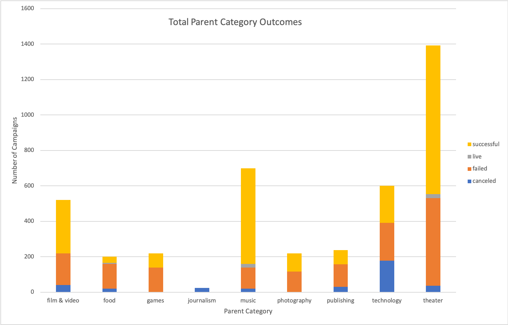

# An Analysis of Kickstarter Campaigns

## Summary
The following project is an analysis of Kickstarter campaigns and how this information can be used to create a successful theatrical Kickstarter campaign.

## Analysis
Out of the 4,114 Kickstarter campaigns used in this project, theatrical campaigns make up approximately 34% of the total campaigns. Out of all campaigns, 2,185 (53%) of the campaigns were successful.  Out of the theatrical campaigns, 839 (63%) were successful. We have found that successful theatrical campaigns make up approximately 38% of the successful Kickstarter campaigns and 20% of the total campaigns used in this project.

## Campaigns in the United States
Campaigns held in the United States reached a total of 3,038 (74%) of the total campaigns used in our research. Out of the 3,038 campaigns held in the United States, 1,651 (54%) of them were successful. This means that approximately 75% of successful Kickstarter campaigns were held in the United States and successful U.S. campaigns make up about 40% of total campaigns used in our research. Of the 3,038 held in the United States, 912 (30%) were theater campaigns. There were 525 successful U.S. theater campaigns, which means that 31% of successful U.S. campaigns fall under the theater parent category. This also means that about 17% of U.S. campaigns were successful theater campaigns. Successful U.S. theater campaigns make up 13% of total campaigns.

## Campaigns in Great Britain
In Great Britain, campaigns reached a total of 604 and make up about 15% of the total campaigns. About 61% of British campaigns were successful. This means that about 17% of total successful campaigns were held in Great Britain and successful British campaigns make up about 9% of our total campaigns. In Great Britain, 359 (about 59%) of campaigns were theatrical campaigns. Of those 359 British theatrical campaigns, 258 (72%) were successful. We have found that 70% of successful British campaigns were theatrical campaigns. This means that successful British theatrical campaigns make up about 43% of total British campaigns and 6% of total campaigns.

## Most Successful Campaign Launch Date

Overall, the most of the successful campaigns were launched in May. 

Likewise, most of the successful U.S. play campaigns were launched in May.

Unlike the previous trends, most of the successful British musical campaigns were launched in June.

## Recommendations

Based on our findings, the best time to start a play campaign based in the United States is in May. The best time to start a musical campaign based in Great Britain is in June. Overall, theatrical campaigns are the most successful category of Kickstarter campaigns.
